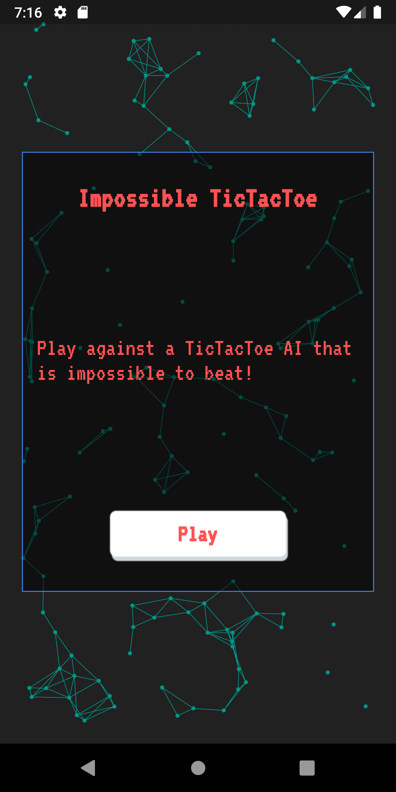
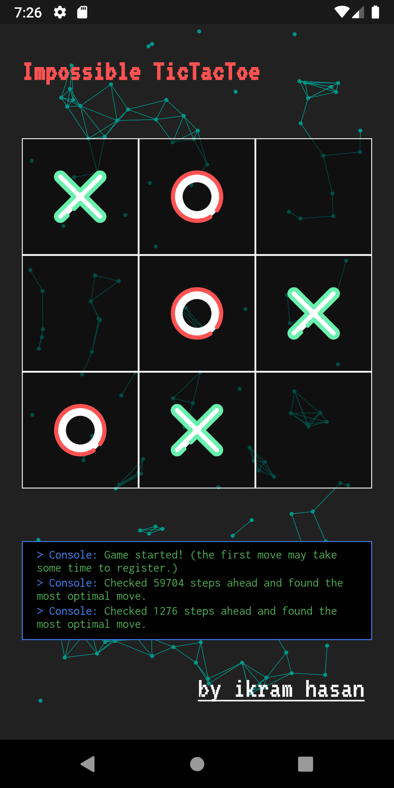
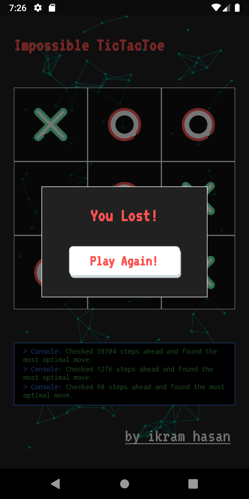

# Impossible TicTacToe

|                         Intro Screen                         |                         Home Screen                         |                      View Result                       |
| :---------------------------------------------------------------: | :-------------------------------------------------------------: | :--------------------------------------------------------------: |
|  |  |  |

## Description
A tictactoe AI that is impossible to beat. Made using Dart and Flutter ❤ Both the UI and the backend of the application was made using Flutter and Dart. The AI uses the minimax algorithm to look through all the possible combination of game states and returns the best one. It will always make the best possible move so the best case for the user is a draw. 

## Demo

### [Website](https://impossible-tictactoe.firebaseapp.com/#/)

A website built with the Flutter Responsive Framework.

### [Android App](https://play.google.com/store/apps/details?id=com.ikramhasan.tic_tac_toe)

An android fat application made using Flutter.

## Features

- [x] Animation Background
- [x] Responsive UI
- [x] Implement MiniMax Algorithm
- [ ] Implement Alpha-Beta Pruning
- [ ] Implement Complex huristics
- [x] Enable Console
- [x] Host site

## My Socials

 
 

  &nbsp &nbsp &nbsp

## License

    BSD Zero Clause License

    Copyright © 2020 Codelessly

    Permission to use, copy, modify, and/or distribute this software for any
    purpose with or without fee is hereby granted.

    THE SOFTWARE IS PROVIDED "AS IS" AND THE AUTHOR DISCLAIMS ALL WARRANTIES WITH
    REGARD TO THIS SOFTWARE INCLUDING ALL IMPLIED WARRANTIES OF MERCHANTABILITY
    AND FITNESS. IN NO EVENT SHALL THE AUTHOR BE LIABLE FOR ANY SPECIAL, DIRECT,
    INDIRECT, OR CONSEQUENTIAL DAMAGES OR ANY DAMAGES WHATSOEVER RESULTING FROM
    LOSS OF USE, DATA OR PROFITS, WHETHER IN AN ACTION OF CONTRACT, NEGLIGENCE OR
    OTHER TORTIOUS ACTION, ARISING OUT OF OR IN CONNECTION WITH THE USE OR
    PERFORMANCE OF THIS SOFTWARE.
